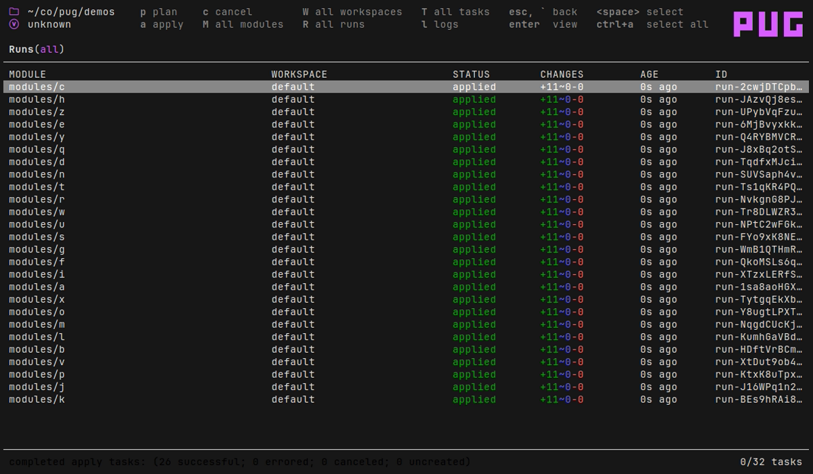

# PUG

A TUI application for terraform power users.

* Perform tasks in parallel (plan, apply, init, etc)
* Manage state resources
* Task queueing.
* Supports tofu as well as terraform
* Supports workspaces
* Backend agnostic

## Modules

Invoke `init`, `validate`, and `fmt` across multiple modules.

## Runs

Create multiple plans and apply them in parallel.

View the output of plans and applies.

## State management

Manage state resources. Taint, untaint and delete multiple resources. Select resources for targeted plans.

## FAQ

### Can I use the [provider plugin cache](https://developer.hashicorp.com/terraform/cli/config/config-file#provider-plugin-cache)?

Yes. However, because the plugin cache does not permit concurrent writes, if pug detects the cache is in use it'll automatically only allow one terraform init task to run at a time.
