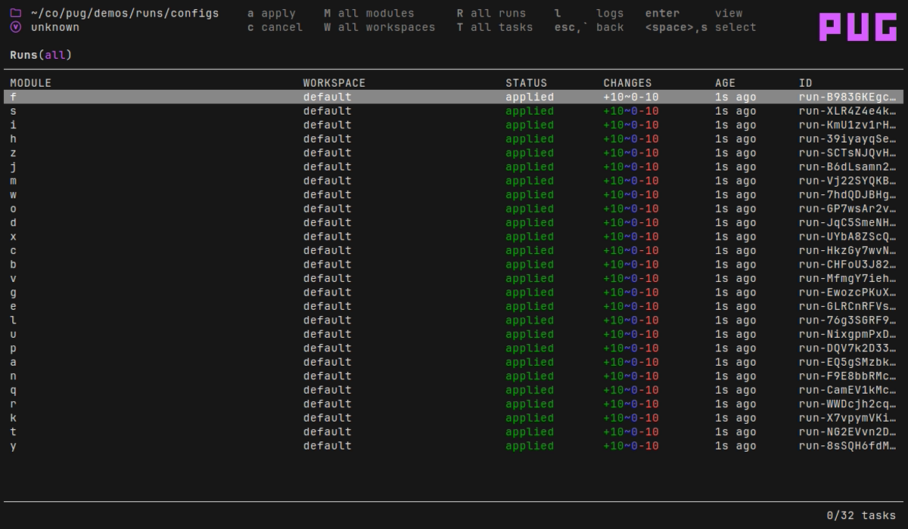
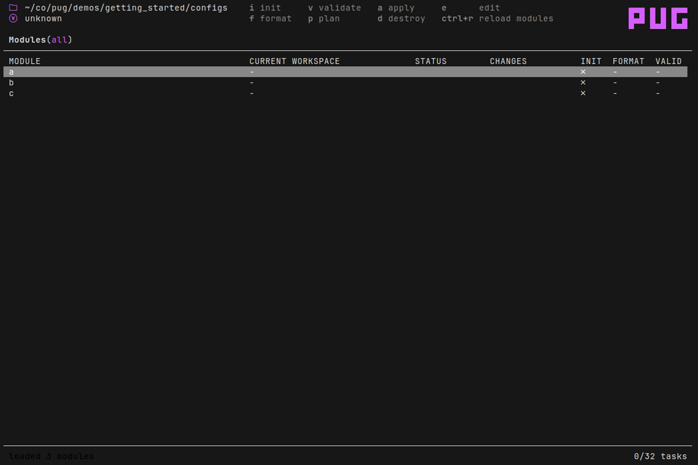
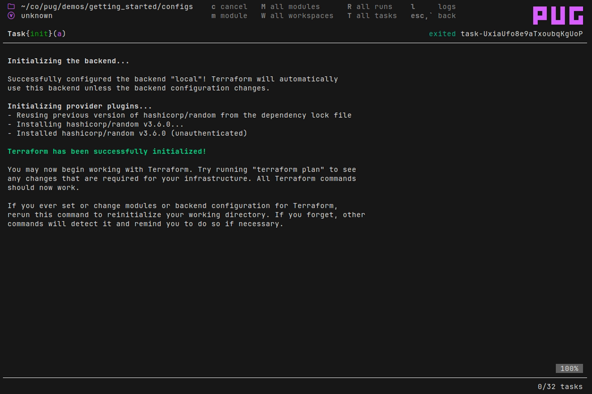
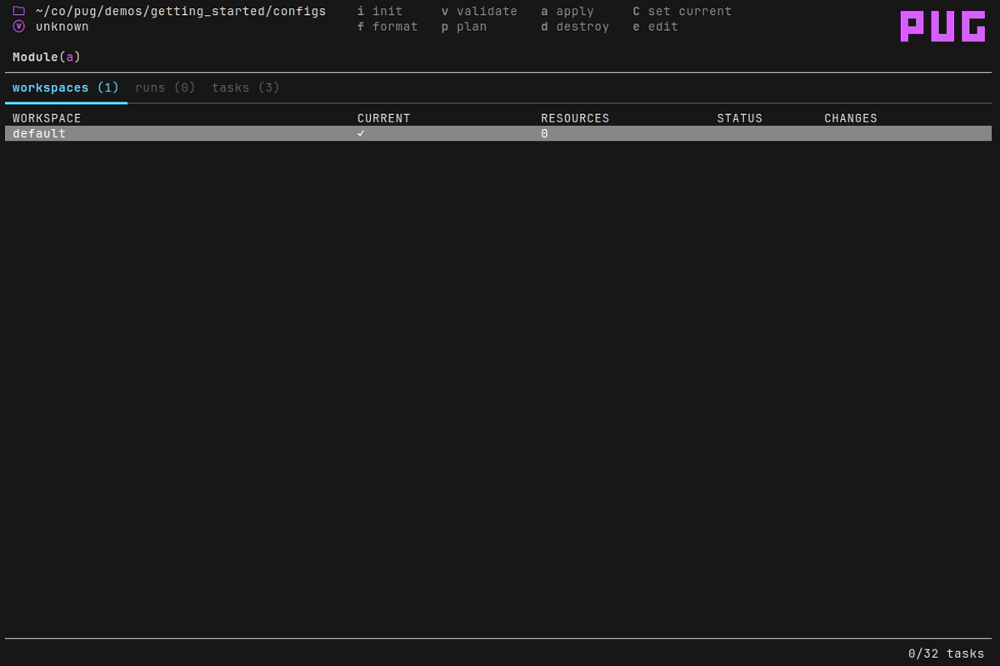
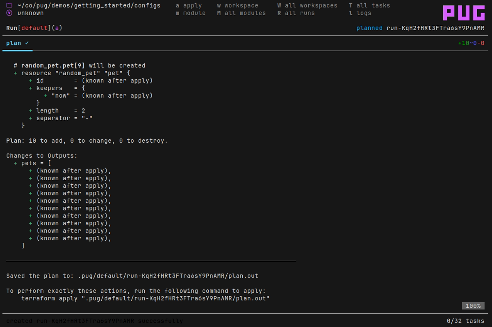
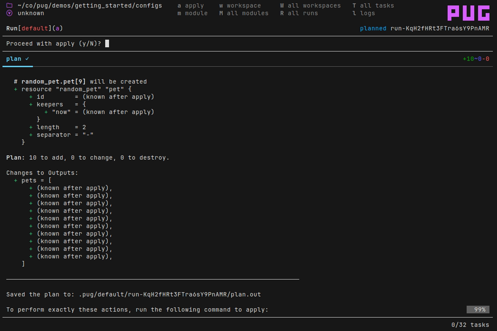
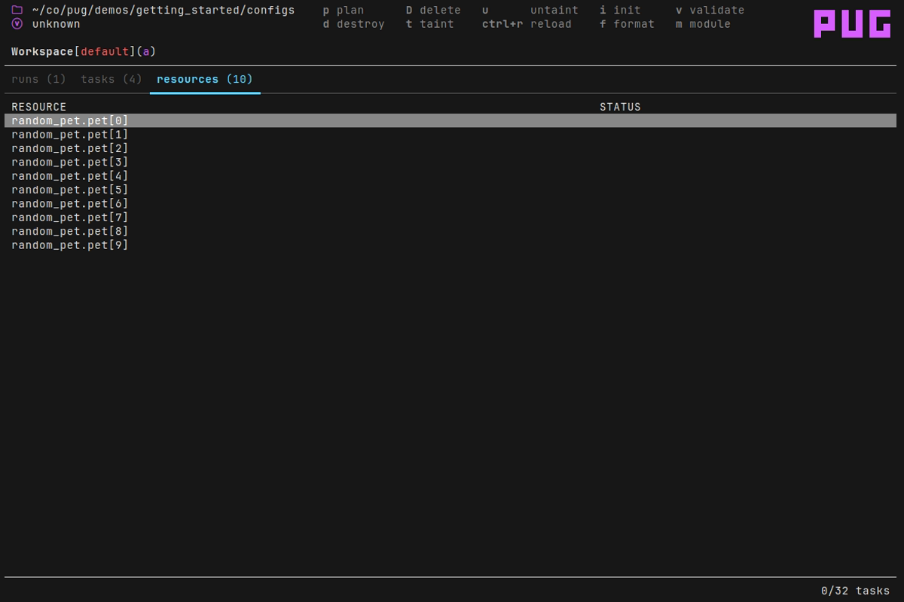

# PUG

A TUI application for terraform power users.

* Perform tasks in parallel (plan, apply, init, etc)
* Manage state resources
* Task scheduling
* Supports tofu as well as terraform
* Supports workspaces
* Backend agnostic



## Demos

### Modules

Invoke `init`, `validate`, and `fmt` across multiple modules.


### Workspaces

Pug supports workspaces. Invoke plan and apply on workspaces. Change the current workspace for a module.


### Runs

Create multiple plans and apply them in parallel.


View the output of plans and applies.


### State management

Manage state resources. Taint, untaint and delete multiple resources. Select resources for targeted plans.


### Tasks

All invocations of terraform are represented as a task.


## Install instructions

With `go`:

```
go install github.com/leg100/pug@latest
```

Homebrew:

```
brew install leg100/tap/pug
```

Or download and unzip a [GitHub release](https://github.com/leg100/pug/releases) for your system and architecture.

## Getting started

Pug requires `terraform` to be installed on your system.

The first time you run `pug`, it'll recursively search sub-directories in the current working directory for terraform root modules.

To get started with some pre-existing root modules, clone this repo, change into the `./demos/getting_started` directory, and start pug:

```bash
git clone https://github.com/leg100/pug.git
cd pug
cd demos/getting_started
pug
```

At startup, pug lists your root modules:



Initialize module `modules/a` by pressing `i`. That takes you to the task view, which includes the output from `terraform init`:



Press `m` to show the corresponding module page for the task:



You'll be presented with multiple tabs. To cycle through tabs press the `tab` key.

On the `workspaces` tab, press `p` to create a plan. That takes you to the `plan` tab in the run view, showing the output from `terraform plan`:



A run is composed of a plan, and optionally an apply. Once the plan has completed, press `a` to apply:



You're presented with a prompt to confirm whether you want to proceed with an apply. Press `y` to confirm. That takes you to the `apply` tab on the run view, showing the output from `terraform apply`:


Note that pug automatically pulls state after a workspace is loaded for the first time, and after an apply completes.

To see the state resources for the workspace, press `w` and cycle through the tabs to the `resources` tab:



This is the end of the getting started walkthrough.

## Configuration

Pug can be configured with - in order of precedence - flags, environment variables, and a config file.

Flags:

```bash
> pug -h
NAME
  pug

FLAGS
  -p, --program STRING               The default program to use with pug. (default: terraform)
  -w, --workdir STRING               The working directory containing modules. (default: .)
  -t, --max-tasks INT                The maximum number of parallel tasks. (default: 32)
  -f, --first-page STRING            The first page to open on startup. (default: modules)
  -d, --debug                        Log bubbletea messages to messages.log
  -v, --version                      Print version.
  -l, --log-level STRING             Logging level. (default: info)
  -c, --config STRING                Path to config file. (default: pug.yaml)
      --disable-reload-after-apply   Disable automatic reload of state following an apply.
```

Environment variables are specified by prefixing the value with `PUG_` and appending the equivalent flag value, replacing hyphens with underscores. For example, to set the max number of tasks to 100, specify `PUG_MAX_TASKS=100`.

The config file by default is expected to be found in the current working directory in which you invoke pug, and by default it's expected to be named `pug.yaml`. Override the default using the flag `-c` or environment variable `PUG_CONFIG`.

## Workspace Variables

Pug automatically loads variables from a .tfvars file. It looks for a file named `<workspace>.tfvars` in the module directory, where `<workspace>` is the name of the workspace. For example, if the workspace is named `dev` then it'll look for `dev.tfvars`. If the file exists then it'll pass the name to `terraform plan`, e.g. for a workspace named `dev`, it'll invoke `terraform plan -vars-file=dev.tfvars`.

## Resource hierarchy

There are several types of resources in pug:

* modules
* workspaces
* runs
* tasks

A task can be belong to a run, a workspace, or a module. A run belongs to a workspace. And a workspace belongs to a module.

### Modules
 
*Note: what Pug calls a module is equivalent to a [root module](https://developer.hashicorp.com/terraform/language/modules#the-root-module), i.e. a directory containing terraform configuration, including a state backend. It is not to be confused with a [child module](https://developer.hashicorp.com/terraform/language/modules#child-modules).*

A module is a directory of terraform configuration with a backend configuration. When Pug starts up, it looks recursively within the working directory, walking each directory and parsing any terraform configuration it finds. If the configuration contains a [state backend definition](https://developer.hashicorp.com/terraform/language/settings/backends/configuration) then Pug loads the directory as a module.

Pug also checks if the module contains a `.terraform` directory. If it does not then the module is marked as *uninitialized*, because `terraform init` needs to be run before it can be deemed *initialized*.

Each module has zero or more workspaces. Following successful initialization the module has at least one workspace, named `default`. One workspace is set as the *current workspace* for the module. When you create a run on a module, the run is created on its current workspace. The latest run on its current workspace is set as the *current run* for the module.

If you add/remove modules outside of Pug, you can instruct Pug to reload modules by pressing `Ctrl-r` on the modules listing.

### Workspaces

A workspace is directly equivalent to a [terraform workspace](https://developer.hashicorp.com/terraform/language/state/workspaces).

When a module is loaded for the first time, Pug automatically creates a task to run `terraform workspace list`, to retrieve the list of workspaces for the module.

When a workspace is loaded into Pug for the first time, it'll create a task that invokes `terraform show -json`, to retrieve the workspace's state.

If you add/remove workspaces outside of Pug, you can instruct Pug to reload workspaces by pressing `Ctrl-w` on a module.

### Runs

A run represents a terraform plan and the optional apply of that plan. Under the hood, it invokes `terraform plan -out <plan-file>`. Should you then apply the run, it invokes `terraform apply <plan-file>`.

A run starts in the `pending` state. If its workspace doesn't have a current run, then Pug transitions it into the `scheduled` state and sets it as the workspace's current run. Otherwise the run remains in the `pending` state until the current run has finished.

If there are no blocked tasks running on its workspace and module (see tasks below) then the run transitions into the `plan queued` state. Once there is sufficient task capacity, the run enters the `planning` state, and `terraform plan` is invoked.

Once `terraform plan` completes, it enters one of several states depending upon the outcome of that task. If there were no changes, then it enters the `no changes` termination state, otherwise it enters the `planned` state.

When you apply a run, it enters the `apply queued` state. Once there is sufficient task capacity, the run enters the `applying` state and `terraform apply` is invoked. Upon success it enters the `applied` state. Pug then automatically creates a task to invoke `terraform show -json`, to retrieve the workspace's updated state. 

A run can be canceled at any stage. If it is `planning` or `applying` then the current terraform process is sent a termination signal. Otherwise, in any other non-terminated state, the run is immediately set as `canceled`.

### Tasks

Each invocation of terraform is represented as a task. A task belongs either to a run, a workspace, or a module.

A task is either non-blocking or blocking. If it is blocking then it blocks tasks created after it that belong either to the same resource, or to a child resource. For example, an `init` task, which is a blocking task, runs on module "A". Another `init` task for module "A", created immediately afterwards, would be blocked until the former task has completed. Or a `plan` task created afterwards on workspace "default" on module "A", would also be blocked.

A task starts in the `pending` state. It enters the `queued` state only if it is unblocked (see above). It remains in the `queued` state until there is available capacity, at which point it enters the `running` state. Capacity determines the maximum number of running tasks, and defaults to twice the number of cores on your system and can be overridden using `--max-tasks`.

An exception to this rule are tasks which are classified as *immediate*. Immediate tasks enter the running state regardless of available capacity. At time of writing only the `terraform workspace select` task is classified as such.

A task can further be classed as *exclusive*. These tasks are globally mutually exclusive and cannot run concurrently. The only task classified as such is the `init` task, and only when you have enabled the [provider plugin cache](https://developer.hashicorp.com/terraform/cli/config/config-file#provider-plugin-cache) (the plugin cache does not permit concurrent writes).

A task can be canceled at any stage. If it is `running` then the current terraform process is sent a termination signal. Otherwise, in any other non-terminated state, the task is immediately set as `canceled`.

## Tofu support

To use `tofu` instead of `terraform`, set `--program=tofu`.
