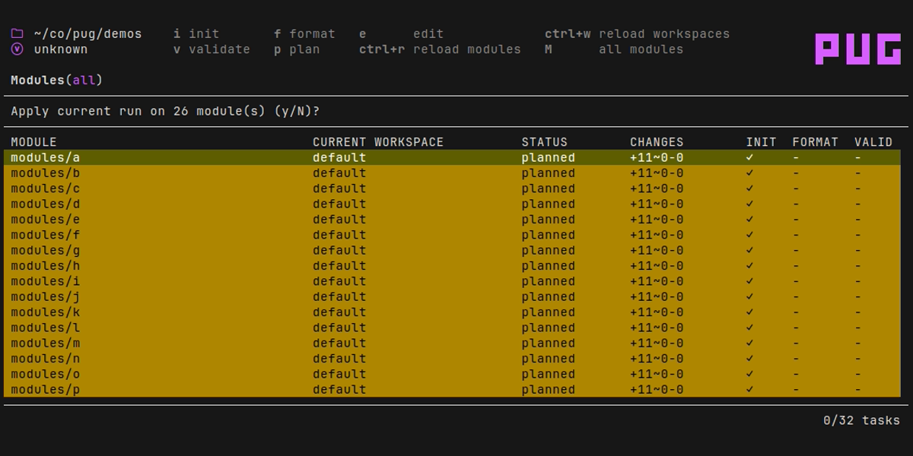

# PUG

A TUI application for terraform power users.

* Perform tasks in parallel (plan, apply, init, state ops etc)
* Built-in queuing of tasks.
* Manage state resources
* Supports tofu as well as terraform
* Supports workspaces
* Backend agnostic

## Modules

*Note: a pug "module" is more accurately a [root module](https://developer.hashicorp.com/terraform/language/modules#the-root-module)*.

## Runs

## State management

## FAQ

### Can I use the [provider plugin cache](https://developer.hashicorp.com/terraform/cli/config/config-file#provider-plugin-cache)?

Yes. However, because the plugin cache does not permit concurrent writes, if pug detects the cache is in use it'll automatically only allow one terraform init task to run at a time.
