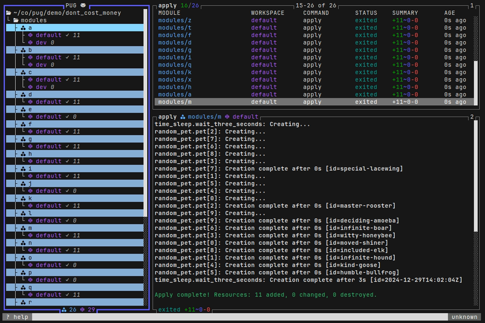
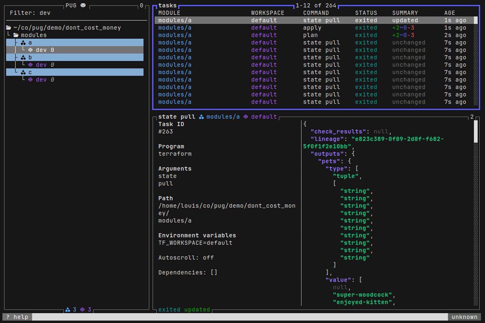

<h1> PUG
<a title="This tool is Tool of The Week on Terminal Trove, The $HOME of all things in the terminal" href="https://terminaltrove.com/">
</a></h1>

A TUI application for terraform power users.

* Perform tasks in parallel (plan, apply, init, etc)
* Interactively manage state resources (targeted plans, move, delete, etc)
* Supports terraform, tofu and terragrunt
* Supports terragrunt dependencies
* Supports workspaces
* Automatically loads workspace variable files
* Backend agnostic (s3, cloud, etc)


## Install instructions

With `go`:

```
go install github.com/leg100/pug@latest
```

Homebrew:

```
brew install leg100/tap/pug
```

Or download and unzip a [GitHub release](https://github.com/leg100/pug/releases) for your system and architecture.

## Getting started

Pug requires `terraform` to be installed on your system.

The first time you run `pug`, it'll recursively search sub-directories in the current working directory for terraform root modules.

To get started with some pre-existing root modules, clone this repo, change into the `./demos/getting_started` directory, and start pug:

```bash
git clone https://github.com/leg100/pug.git
cd pug
cd demos/getting_started
pug
```

## Configuration

Pug can be configured with - in order of precedence - flags, environment variables, and a config file.

Flags:

```bash
> pug -h
NAME
  pug

FLAGS
  -p, --program STRING               The default program to use with pug. (default: terraform)
  -w, --workdir STRING               The working directory containing modules. (default: .)
  -t, --max-tasks INT                The maximum number of parallel tasks. (default: 32)
      --data-dir STRING              Directory in which to store plan files. (default: /home/louis/.pug)
  -e, --env STRING                   Environment variable to pass to terraform process. Can set more than once.
  -a, --arg STRING                   CLI arg to pass to terraform process. Can set more than once.
  -f, --first-page STRING            The first page to open on startup. (default: modules)
  -d, --debug                        Log bubbletea messages to messages.log
  -v, --version                      Print version.
  -c, --config STRING                Path to config file. (default: /home/louis/.pug.yaml)
      --disable-reload-after-apply   Disable automatic reload of state following an apply.
  -l, --log-level STRING             Logging level (valid: info,debug,error,warn). (default: info)
```

Environment variables are specified by prefixing the value with `PUG_` and appending the equivalent flag value, replacing hyphens with underscores, e.g. `--max-tasks 100` is set via `PUG_MAX_TASKS=100`.

The config file by default is expected to be found at `$HOME/.pug.yaml`. Override the default using the flag `-c` or environment variable `PUG_CONFIG`. The config uses YAML format. Set values in the config file by removing the `--` prefix from the equivalent flag value, e.g. `--max-tasks 100` is set like so in the config file:

```yaml
max-tasks: 100
```

## Workspace Variables

Pug automatically loads variables from a .tfvars file. It looks for a file named `<workspace>.tfvars` in the module directory, where `<workspace>` is the name of the workspace. For example, if the workspace is named `dev` then it'll look for `dev.tfvars`. If the file exists then it'll pass the name to `terraform plan`, e.g. for a workspace named `dev`, it'll invoke `terraform plan -vars-file=dev.tfvars`.

## Pages

### Modules


 
Press `m` to go to the modules page.

*Note: what Pug calls a module is equivalent to a [root module](https://developer.hashicorp.com/terraform/language/modules#the-root-module), i.e. a directory containing terraform configuration, including a state backend. It is not to be confused with a [child module](https://developer.hashicorp.com/terraform/language/modules#child-modules).*

A module is a directory of terraform configuration with a backend configuration. When Pug starts up, it looks recursively within the working directory, walking each directory and parsing any terraform configuration it finds. If the configuration contains a [state backend definition](https://developer.hashicorp.com/terraform/language/settings/backends/configuration) then Pug loads the directory as a module.

Each module has zero or more workspaces. Following successful initialization the module has at least one workspace, named `default`. One workspace is set as the *current workspace* for the module. When you run a plan or apply on a module, it is created on its current workspace.

If you add/remove modules outside of Pug, you can instruct Pug to reload modules by pressing `Ctrl-r` on the modules listing.

#### Key bindings

| Key | Description | Multi-select |
|--|--|--|
| `i`|terraform init|&check;|
| `f`|terraform fmt|&check;|
| `v`|terraform validate|&check;|
| `p`|terraform plan|&check;|
| `P`|terraform plan -destroy|&check;|
| `e`|Open module path in editor|&check;|
| `Ctrl+r`|Reload all modules|&check;|
| `Ctrl+w`|Reload module's workspaces|&check;|

### Workspaces



Press `w` to go to the workspaces page.

*Note: A workspace is directly equivalent to a [terraform workspace](https://developer.hashicorp.com/terraform/language/state/workspaces).*

Workspaces listed here are parsed from the output of `terraform workspace list`, which is automatically run at startup.

#### Key bindings

| Key | Description | Multi-select |
|--|--|--|
|`i`|Run `terraform init`|&check;|
|`f`|Run `terraform fmt`|&check;|
|`v`|Run `terraform validate`|&check;|
|`p`|Run `terraform plan`|&check;|
|`P`|Run `terraform plan -destroy`|&check;|
|`a`|Run `terraform apply`|&check;|
|`d`|Run `terraform apply -destroy`|&check;|
|`C`|Run `terraform workspace select`|&cross;|

### State


Press `s` to go to the state page.

When a workspace is loaded into Pug for the first time, a task is created to invoke `terraform state pull`, which retrieves workspace's state, and then the state is loaded into Pug. The task is also triggered after any task that alters the state, such as an apply or moving a resource in the state.

#### Key bindings

| Key | Description | Multi-select |
|--|--|--|
|`p`|Run `terraform plan -target`|&check;|
|`d`|Run `terraform plan -destroy -target`|&check;|
|`D`|Run `terraform state rm`|&check;|
|`M`|Run `terraform state mv`|&cross;|
|`Ctrl+t`|Run `terraform taint`|&check;|
|`Ctrl+u`|Run `terraform untaint -destroy`|&check;|
|`Ctrl+r`|Run `terraform state pull`|-|

### Tasks



Press `t` to go to the tasks page.

Each invocation of terraform is represented as a task.

A task is either non-blocking or blocking. Blocking tasks block their workspace or module, and prevent from further tasks from being enqueued until the blocking task has finished. For example, an `init` task, a blocking task, runs on module "A". Another `init` task for module "A", created immediately afterwards, would be blocked until the former task has completed. Or a `plan` task created afterwards on workspace "default" on module "A", would also be blocked. Blocking tasks in this manner prevent concurrent writes to resources that don't permit concurrent writes, such as the terraform state.

A task starts in the `pending` state. It enters the `queued` state only if it is unblocked (see above). It remains in the `queued` state until there is available capacity, at which point it enters the `running` state. Capacity determines the maximum number of running tasks, and defaults to twice the number of cores on your system and can be overridden using `--max-tasks`.

An exception to this rule are tasks which are classified as *immediate*. Immediate tasks enter the running state regardless of available capacity. At time of writing only the `terraform workspace select` task is classified as such.

A task can further be classed as *exclusive*. These tasks are globally mutually exclusive and cannot run concurrently. The only task classified as such is the `init` task, and only when you have enabled the [provider plugin cache](https://developer.hashicorp.com/terraform/cli/config/config-file#provider-plugin-cache) (the plugin cache does not permit concurrent writes).

A task can be canceled at any stage. If it is `running` then the current terraform process is sent a termination signal. Otherwise, in any other non-terminated state, the task is immediately set as `canceled`.

| Key | Description | Multi-select |
|--|--|--|
|`c`|Cancel task|&check;|
|`r`|Retry task|&check;|
|`Enter`|Full screen task output|&cross;|
|`S`|Toggle split screen|-|
|`+`|Increase split screen top pane size|-|
|`-`|Decrease split screen top pane size|-|
|`tab`|Switch split screen pane focus|-|

### Task Groups


Press `T` to go to the tasks groups page.

Creating multiple tasks - via a selection - creates a task group. The status of the tasks is 

## Tofu support

To use tofu, set `--program=tofu`. Ensure it is installed first.

## Terragrunt support

To use terragrunt, set `--program=terragrunt`. Ensure it is installed first.

When `terragrunt` is specified as the program executable, Pug enables "terragrunt mode":

* Modules are detected via the presence of a `terragrunt.hcl` file. (You may want to rename the top-level `terragrunt.hcl` file to something else otherwise it is mis-detected as a module).
* Module dependencies are supported. After modules are loaded, a task invokes `terragrunt graph-dependencies`, from which dependencies are parsed and configured in Pug. If you apply multiple modules Pug ensures their dependencies are respected, applying modules in topological order. If you apply a *destroy* plan for multiple modules, modules are applied in reverse topological order.
* The flag `--terragrunt-non-interactive` is added to commands.
